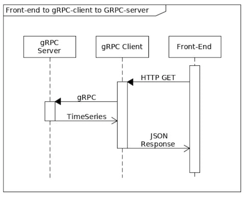

# Python gRPC-based microservice

### gRPC Server

The gRPC Server is a simple Python application that uses grpcio to implement the proto services defined in proto/meter_usage.proto. The application exposes the gRPC server on the arbitrary port 51510.

### gRPC Client

The gRPC Client is implemented with the use of Flask. Flask utilizes the gRPC client stub and is responsible for replying to the incoming HTTP request with the appropriate JSON stream based on the meter usage timeseries. During development, and when deployed, Flask exists behind a WSGI HTTP server on port 5000 that relays the incoming requests. In this context, the combination of Flask + HTTP Server is referred to as the gRPC Client.

### Front-End

The Front-End is a single HTML page served by the HTTP server for convenience's sake and to avoid CORS errors when serving the page from file://. The page uses vanilla JavaScript to hit the HTTP server with GET requests and to retrieve the JSON timeseries. The data is shown in a simple table.

## Architecture



The use case demands for a csv file with timeseries meter usage data to be trasmitted to the client as JSON. It is assumed that the csv resides directly on the gRPC  server filesystem. Given that the order of magnitude for the entry is in the thousands, streams coupled with generator are used to avoid high memory footprint.

## Deployment

## localhost

Optionally create a virtual environment:

```console
python3 -m venv .venv
source .venv/bin/activate
```

Install the dependencies

```console
python -m pip install --upgrade pip
python -m pip install -r requirements.txt
```

Compile the proto services

```console
make proto-compile-server
make proto-compile-client
```

Deploy the rpc-server

```console
make run-server
```

Deploy the rpc-client

```console
make run-client
```

## docker-compose

```console
docker-compose up --build
```

Visit: http://localhost:5000